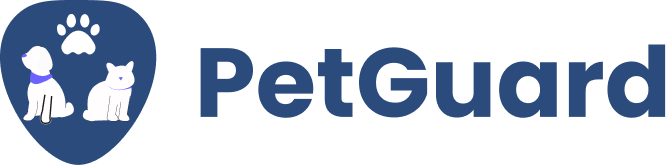

# PetGuard 🐶🐱 - Sistema de Gestão para Pets



Bem-vindo ao **PetGuard**! Um sistema moderno e intuitivo para ajudar na gestão de informações e cuidados com seus pets.

## 🚀 Sobre o Projeto
O **PetGuard** foi desenvolvido para facilitar o acompanhamento da saúde e bem-estar dos animais de estimação, proporcionando um ambiente organizado para armazenar e gerenciar informações essenciais, como vacinas, consultas veterinárias, alimentação e muito mais.

## 🛠️ Tecnologias Utilizadas
- **Backend:** PHP 8.1, Laravel, Livewire, API Platform, PostgreSQL  
- **Frontend:** Laravel Livewire, Tailwind CSS  
- **Infraestrutura:** Docker, JWT para autenticação, Render para hospedagem  

## 🎯 Funcionalidades
✅ Cadastro e gerenciamento de pets 🐕🐈  
✅ Histórico de vacinas e consultas veterinárias 💉🏥  
✅ Agendamento de consultas e lembretes 📅🔔  
✅ Registro de alimentação e hábitos diários 🍖🥕  
✅ Sistema de login seguro com JWT 🔐  
✅ Dashboard interativo e responsivo 📊  

## 📦 Instalação e Configuração
### Pré-requisitos
Certifique-se de ter instalado:
- Docker e Docker Compose  
- PHP 8.1  
- Composer  
- Node.js e NPM  

### Passos para rodar o projeto
1. Clone o repositório:
   ```bash
   git clone https://github.com/Francielefernandes06/PetGuard-Web.git
   cd PetGuard
